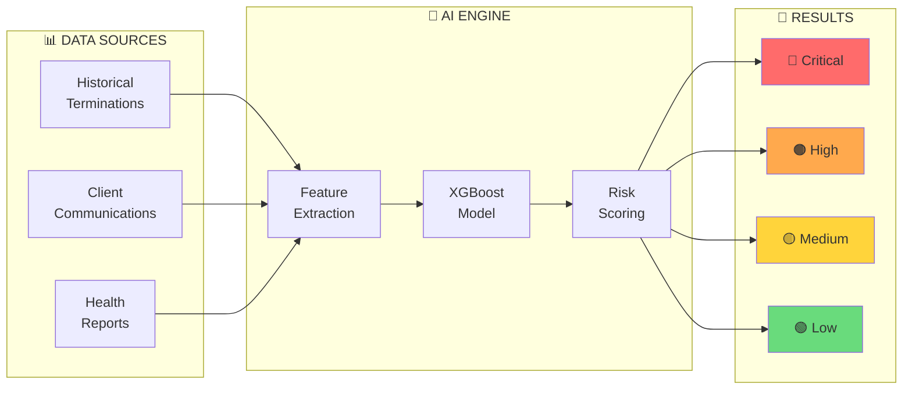
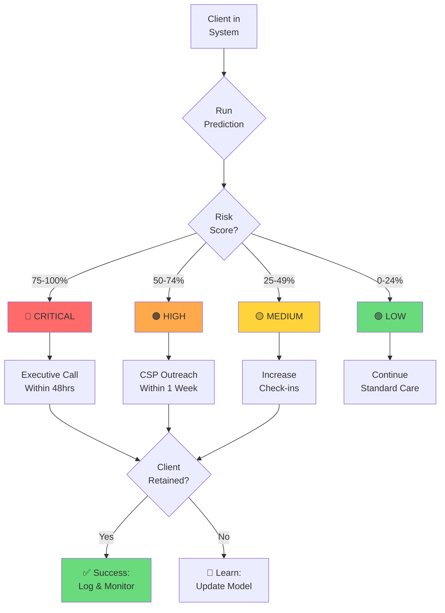
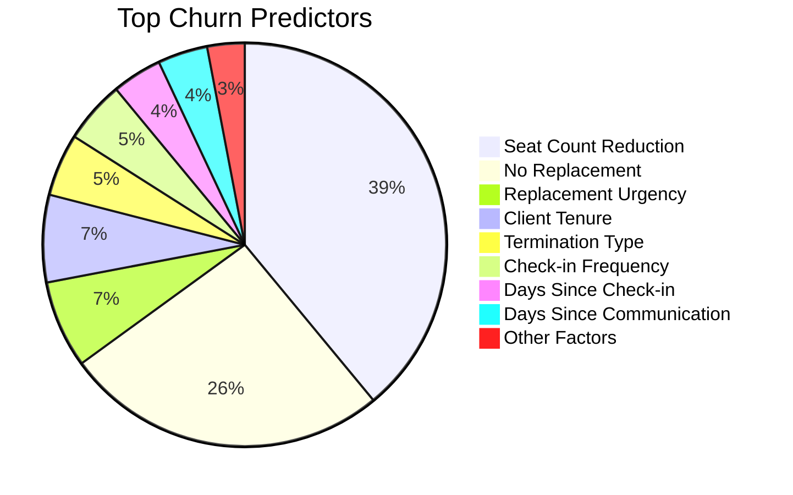
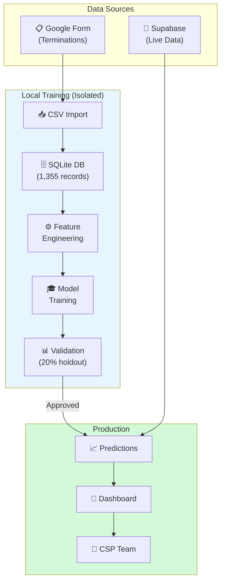
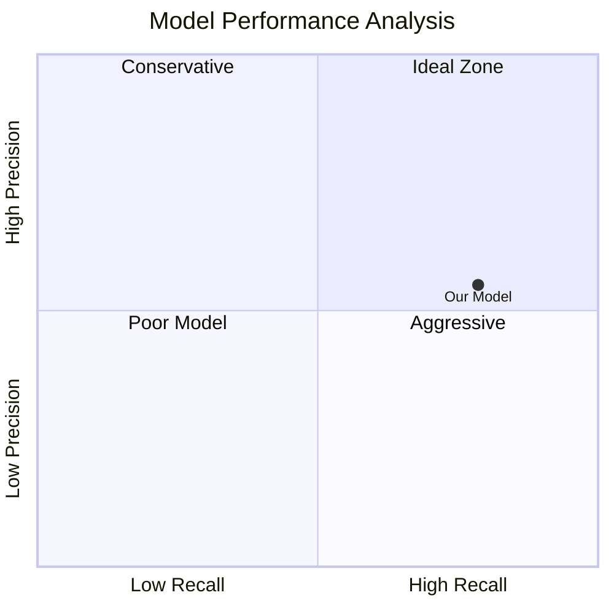
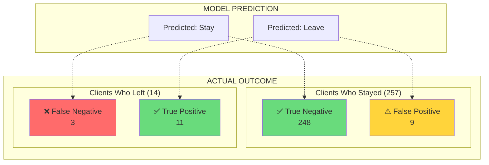
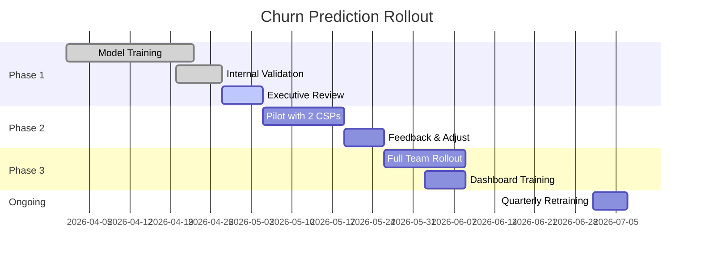

# Churn Prediction System - Visual Diagrams
# Copy these to Mermaid Live Editor: https://mermaid.live/

## Diagram 1: High-Level System Flow

---

## Diagram 2: Decision Flow

---

## Diagram 3: Feature Importance

---

## Diagram 4: Data Pipeline

---

## Diagram 5: Model Performance Overview

---

## Diagram 6: Confusion Matrix Visual

---

## Diagram 7: Implementation Timeline

---

## How to Use These Diagrams

### Option 1: Mermaid Live Editor
1. Go to https://mermaid.live/
2. Copy any diagram code above
3. Paste into editor
4. Download as PNG/SVG

### Option 2: VS Code Extension
1. Install "Markdown Preview Mermaid Support"
2. Open this file in VS Code
3. Preview to see rendered diagrams

### Option 3: Google Slides
1. Export diagrams as PNG from Mermaid Live
2. Insert images into Google Slides
3. Add text and animations

### Option 4: Notion/Confluence
1. Both support Mermaid natively
2. Paste code blocks directly
3. They render automatically
